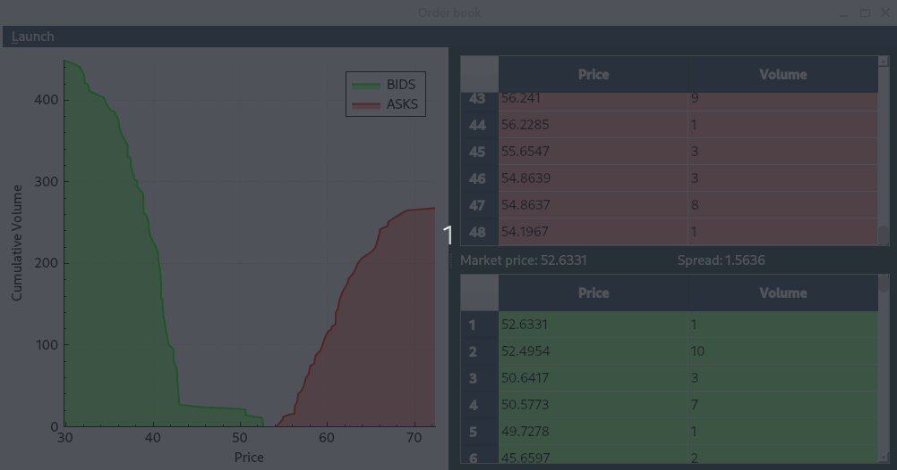

# Order Book Simulator



## 📈Description

A high-performance limit order book simulator with real-time Qt5 visualization, multi-threaded 
trading simulation, and market depth chart. Designed for educational purposes, algorithmic 
strategy backtesting, and as a foundation for trading system components.

---

## ✨ Features

### **Core Engine**

· Full order lifecycle – Add, modify, delete, and execute orders (bids & asks)

· O(1) order lookup by ID – Uses unordered_map<OrderID, iterator> with iterator caching

· Fixed-point price representation – Stored as uint64_t ticks (1e5 precision),
avoiding floating-point key issues in std::map

· Market order execution – Execute against best prices with partial/full fill support

· Crossing order detection – Orders that cross the spread execute immediately (real 
exchange logic)

· Market data – Best bid/ask, spread, volume at price, last traded (i.e. market) price

### **Visualization (Qt5)**

· Depth of Market (DOM) chart – Cumulative bid/ask volumes using QCustomPlot

· Order book tables – Display all price levels with prices and total volumes

· Real-time updates – GUI refreshes automatically on every book change via signals/slots

· Resizable layout – Splitter between DOM chart and tables

### **Trading Simulation**

· Multi-threaded – Simulation runs in a separate QThread, GUI remains responsive

· Randomized market actions – Add, modify, delete, execute with configurable frequencies

· Statistical distributions – Poisson for action generation, Normal for price generation, and Uniform for other parameters 

· Pre-population phase – First 10 iterations initialize both sides of the book with orders

---

## 🚀 Quick Start

### **Prerequisites**

· C++11 compatible compiler

· CMake (3.25+)

· Qt5 (Core, Widgets, PrintSupport)

· GoogleTest (for unit tests)

· QCustomPlot (included in repository)

### **Build & Run**

```bash
# Clone the repository
git clone https://github.com/KostyaDavydov/order_book.git
cd order_book
# Build the project
mkdir build && cd build
cmake ..
make
# Run the GUI application
./gui/gui_exe
# Run tests
./test_exe
```
---

## 📖 Usage

### **Basic API Example**
```cpp
#include "orderbook.h"

OrderBook book;

// Add limit orders
book.add_order(1, 51, 10, OrderType::ASK); //Ask 
book.add_order(2, 49, 15, OrderType::BID); //Bid 

// Query market data
double best_bid = book.best_bid(); // 49.0
double best_ask = book.best_ask(); // 51.0
double spread = book.spread(); // 2.0

// Execute market order (sells 10 units at best bid)
uint64_t executed = book.execute(OrderType::BID, 10);

// Modify existing order
book.modify_order(1, 52, 20);

// Delete order
book.delete_order(2);
```
### **Simulation Control**

The menu bar contains the `Launch` menu with the `Simulation` submenu which has two sections for simulation process manipulation:

· Start Simulation – Launches the multi-threaded trading simulation

· Stop Simulation – Safely terminates the simulation thread

The DOM chart and order book tables update in real-time as orders are added, deleted, modified, 
and executed.

---
## 🧱Architecture

### **Data Structures**

|Component|Implementation|Complexity|
|-|-|-|
|Price levels|std::map<Price, PriceLevel> with custom comparator for bid/ask price levels|O(log n) access|
|Order lookup table|std::unordered_map<OrderID, std::list\<Order>::iterator>|O(1) access on average|
|Order lists|std::list\<Order> per price level|O(1) insertion/deletion|

### **Key Design Decisions**
1. Iterator Caching – Storing iterators in the ID map enables O(log N) deletion without scanning 
price levels.
2. Fixed-Point Prices – Prevents floating-point precision issues when using prices as 
std::map keys.
3. Thread-Safe Simulation – std::atomic\<bool> flag for clean thread termination.
4. Signal-Driven GUI – Qt signals (book_updated()) decouple simulation from visualization.

### **Classes Overview**
```
OrderBook
  - add_order() // with immediate execution for crossing orders
  - delete_order() // delete an order from a book
  - modify_order() // update price and/or volume
  - execute_order() // execute the given order
  - execute() // market order execution
  - best_bid/ask() // best price queries
  - spread() // current spread
  - market_price() // last executed price
  - volume_at_price() // get the volume at the given price
  - price_levels_for_type() // vector of (price, volume) pairs for DOM display

OrderBookWidget
  - init_tables() / init_custom_plot() / init_menu() // init-tion of the interface elements
  - apply_styles() // visual styling
  - update_book_presentation() // refreshes tables + DOM
  - update_graphs() // update graphical representation
  - create_configure_start_thread() // create, configure, and start the trading simulation thread
  - finish_simulation() // signal for the thread to finish the simulation process
  

TradingSimulationThread
  - run() // main simulation loop with random actions
  - finish_request() // thread-safe termination trigger
  - book_updated() // signal to refresh GUI
```
---
## 🧪Testing

The project uses GoogleTest with comprehensive coverage:

· order addition (validation, crossing orders)

· order modification (volume-only and price+volume)

· order deletion (including empty price level cleanup)

· order execution (partial, full, multi-level, over-execution)

· market data queries (best bid/ask, spread, volume at price)

· edge cases (empty book, invalid IDs, zero volume)

Run tests with:
```bash
./build/test_exe
```
---
## 📊 Performance Optimizations

· O(log N) deletion – Iterator caching eliminates price level scans

· Cached vectors – DOM chart data (m_askPrices, m_bidPrices, m_askCumulVolumes, m_bidCumulVolumes) avoid allocations on every book update

· Fixed-point arithmetic – Integer price comparisons instead of floating-point

· Separate simulation thread – GUI never blocks during heavy simulation loads

---
## 🤝Contributing

Contributions are welcome! Please feel free to submit pull requests or open issues.

1. Fork the repository
2. Create your feature branch (git checkout -b feature/amazing-feature)
3. Commit your changes (git commit -m 'Add amazing feature')
4. Push to the branch (git push origin feature/amazing-feature)
5. Open a Pull Request

Please ensure your code follows the existing style and includes appropriate tests.

---
## 📧 Contact

Author – Konstantin Davydov – [davydov.e.konstantin@gmail.com]

Project Link – https://github.com/KostyaDavydov/order_book.git
